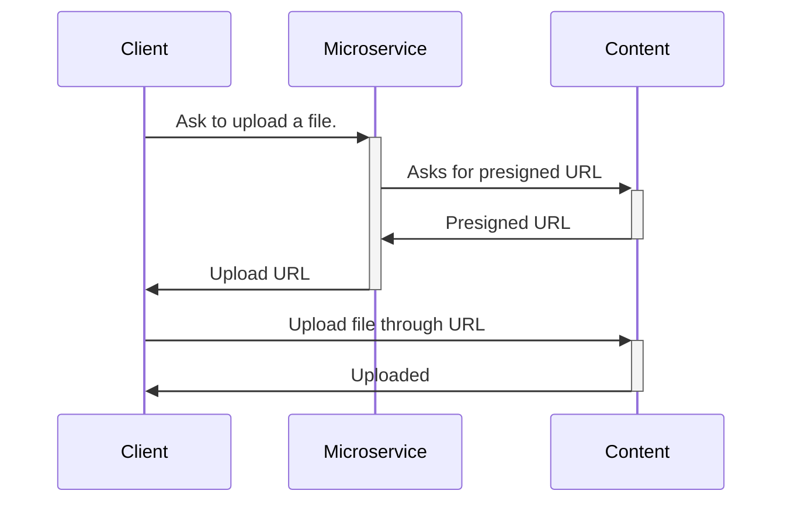

# Beep Content Service

This service provides all the nitty-gritty details to manage content and object storage
in Beep.

For now, these objects are :
- Message attachments
- Profile pictures
- Server banners and icons

## How to use it ?

Here is the flow that you should implement if you want to upload files :



### First, inside your rust microservice, add the following dependency :

```toml
[dependencies]
reqwest = "0.12.24"
```

Then you can use the following code to get a presigned URL for uploading a file :

```rust
async fn fetch_presigned_url(bucket: &str, key: &str) -> Result<String> {
    let client = reqwest::Client::new();
    let url = format!("http://content.beep.com/profile_picture/index.jpg", bucket, key);
    let response = client.post(url)
        .json(&serde_json::json!({
            "action": "Put",
            "expires_in_ms": 1000
        }))
        .send()
        .await
        .expect("Failed to make request");

    let binding = response.json::<serde_json::Value>().await.unwrap();
    let url = binding["url"].as_str().unwrap();
    Ok(url)
}
```

You might need to expose this function to your client through a public API.

```rust
async fn app() -> Result<Router> {
    let router = Router::new()
        .route("/profile_picture/:key", get(get_profile_picture));
}
```
